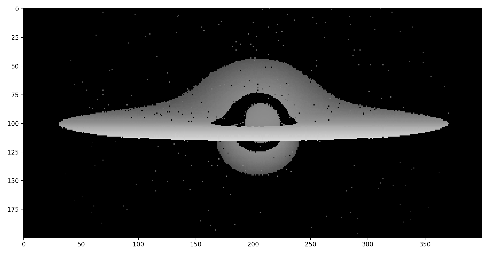

# Zigularity

<p align="center">
    <i>Itsy-bitsy-teeny-weeny-black-hole-visualisation-machiney</i>
</p>

A little long weekend project: relativistic ray tracing in Zig, visualizing thin accretion discs around a Kerr black hole with a handful of configurable parameters:

- observer position
- disc inner and outer radius
- black hole mass and spin

```bash
git clone https://github.com/fjebaker/zigularity
cd zigularity
zigmod fetch
zig build -Drelease-fast
```

Default is to try and calculate the coordinate-time of each traced photon (pixel) -- darker colours indicate things further away to give a slight semblance of three-dimensionality. The program should output something similar to this:

<p align="center">
    
</p>

The program will write the output to a plain-text file `"disc.data"`, which may be plotted with your plotting package of choice. As an example, here is a little bit of Python:

```py
import matplotlib.pyplot as plt
import numpy as np

with open("disc.data") as f:
    data = f.read()

image = []
for line in data.split("\n"):
    row = line.split(",")[:-1]
    if row:
        image.append(row)

img = np.array(image, dtype=float)

plt.imshow(
    img.transpose(), 
    # only want to color close to the black hole
    vmin = 900, 
    vmax = 1100,
    cmap = "Greys"
)
plt.show()
```

## Todo

- [ ] fix bad pixels bugs
- [ ] _severely_ clean and refactor the code
- [ ] interpolate on integrator callback to smoothen the disc
- [ ] (stretch) multi-threading cus it's a wee bit slow

## Dependencies

Requires [nektro/zigmod](https://github.com/nektro/zigmod) to install dependencies:

- [fjebaker/zigode](https://github.com/fjebaker/zigode)


## About

I write relativistic ray tracing codes as part of my research, feel free to [take a look](https://github.com/astro-group-bristol/Gradus.jl) (~:

Relativistic ray-tracing is similar to regular ray-tracing, except that the trajectory of light may be altered due to the locally curved spacetime under strong gravity (see [gravitional lensing](https://en.wikipedia.org/wiki/Gravitational_lens)). The trajectories may be traced by solving the [geodesic equation](https://en.wikipedia.org/wiki/Solving_the_geodesic_equations) -- a 2nd order ODE system which can be quite stiff -- however certain formulations of curved space permit a 1st order set of equations.

One such spacetime is the spacetime of the [Kerr metric](https://en.wikipedia.org/wiki/Kerr_metric), describing a black hole with angular momentum. This metric is parameterised by a black hole mass $M$ and spin $a$, and is axis-symmetric about the spin axis and unchanging with time.

This code implements equations from [Bardeen et al. (1972)](https://ui.adsabs.harvard.edu/link_gateway/1972ApJ...178..347B/ARTICLE) and [Fanton et al. (1997)](https://www.researchgate.net/publication/234370864_Detecting_Accretion_Disks_in_Active_Galactic_Nuclei) to construct the 1st order equations, and integrates them using a simple adaptive Runge-Kutta algorithm.
